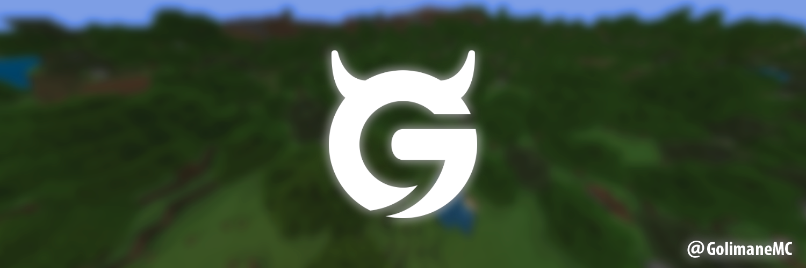

# regolith-filters by Golimane

<div align="center">
  
</div>

<p align="center">
  <a href="https://github.com/Golimane/regolith-filters"></a>
  <a href="./LICENSE"></a>
  <a href="https://github.com/Bedrock-OSS/regolith"></a>
</p>

My collection of **free to use** custom Regolith filters

# 📦 Available Filters

| Link                                    | Short Description                                                                     |
| --------------------------------------- | ------------------------------------------------------------------------------------- |
| [Sound Ninja](./sound_ninja/)      | Automatically add a sound reference to every blocks of `BP/blocks`. |

---

_Detailed filter documentation, installation guides, and configuration examples are provided below._

## 🚀 Quick Start

### Installation

Each filter can be installed individually using Regolith:

```bash
# Install specific filters by folder name
regolith install github.com/Golimane/regolith-filters/sound_ninja
```

### Usage

Add filters to your Regolith profile in `config.json`:

### General Requirements

- [Regolith](https://github.com/Bedrock-OSS/regolith) - Bedrock Edition development framework
- Python 3.7+ (for Python-based filters)

### Filter-Specific Requirements

- **Sound ninja**: `commentjson`, `reticulator` Python Libraries

Install Python dependencies:

```bash
pip install commentjson reticulator
```

## 🤝 Contributing

Contributions are welcome! Whether you want to report a bug or give ideas!

## 📄 License

This project is licensed under the MIT License - see the [LICENSE](LICENSE) file for details.

---

⭐ **Star this repository if you find these filters helpful!** ⭐
